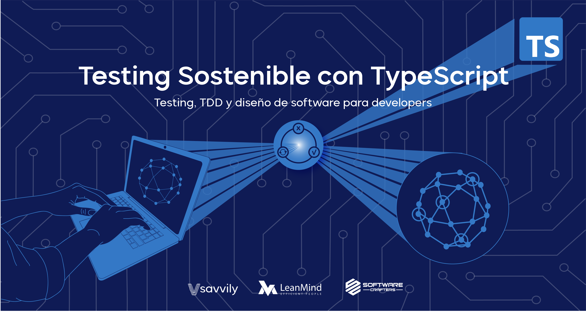

##  Testing Sostenible con TypeScript - Testing, TDD y diseño de software para developers 

Proyecto con las katas del curso.

## Instrucciones

* `nvm use`
* `npm install`
* `npm test`

Más información sobre el curso en [testingsostenible.com](https://testingsostenible.com)